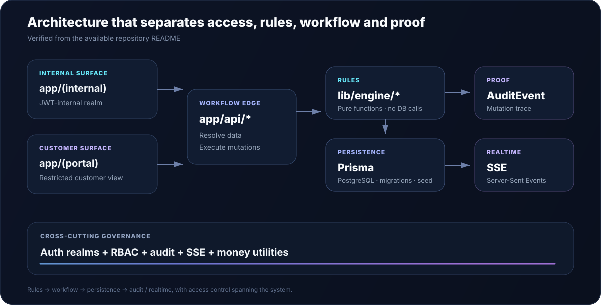

<p align="center">
  
</p>

<p align="center">
  
</p>

<p align="center">
  <strong>Self-governing B2B sales operations, with business rules that execute consistently and every important action remaining traceable.</strong>
</p>

<p align="center">
  Built by <strong>Team StackForge</strong> for the <strong>Odoo Hackathon 2026 Finals</strong>
</p>

<p align="center">
  
  
  
  
  
  
  
</p>

<p align="center">
  <code>Next.js 16 App Router</code> ·
  <code>PostgreSQL</code> ·
  <code>Prisma</code> ·
  <code>Pure Business Engines</code> ·
  <code>RBAC</code> ·
  <code>SSE</code> ·
  <code>Localhost-first</code>
</p>

---

## Overview

**DealFlow360** is a B2B deal operations platform designed around a simple architectural principle:

```text
RULES / CONFIG
      ↓
   ENGINES
      ↓
   WORKFLOW
      ↓
    AUDIT

RBAC + SEPARATE ACCESS REALMS
```

Instead of spreading critical commercial rules across UI components, database queries, spreadsheets, and manual decisions, DealFlow360 isolates business logic into deterministic engines.

API routes coordinate the workflow.
RBAC controls access.
`AuditEvent` records actions.
Server-Sent Events propagate updates.

The result is more than a CRUD dashboard. It is a governed deal-execution system whose important business decisions can be **tested, inspected, traced, and demonstrated independently**.

---

## The Problem

B2B deal execution becomes difficult when quotations, approvals, inventory decisions, billing calculations, and customer communication operate as disconnected processes.

### Margin leakage

Sales decisions become risky when pricing, discount logic, and operational constraints are handled manually or inconsistently.

### Approval delays

Commercial exceptions frequently depend on manual manager intervention, spreadsheets, messages, or disconnected approval chains.

### Fragmented warehouse decisions

Inventory distributed across warehouses creates allocation decisions that must remain predictable and explainable.

### Hybrid billing complexity

Subscription-style and proportional billing scenarios require precise proration instead of approximate calculations.

### Disconnected customer experience

Internal deal operations and customer-facing access should not share the same unrestricted application surface.

DealFlow360 brings these concerns into one controlled workflow.

---

## The Solution

DealFlow360 treats the deal lifecycle as a combination of **deterministic business engines and governed workflow orchestration**.

The verified implementation focuses on:

* **Risk scoring**
* **Approval routing**
* **Warehouse split logic**
* **Billing proration**
* **Restricted customer portal access**
* **Role-Based Access Control**
* **Audit events**
* **Server-Sent Events**
* **Local PostgreSQL persistence through Prisma**
* **Automated testing of core business calculations**

Instead of allowing business decisions to become hidden inside route handlers or frontend code:

> **Engines decide. Workflows coordinate. RBAC restricts. Audit records. SSE propagates.**

---

## Core Differentiators

| Principle                    | Implementation                                                                    | Why it matters                                                                |
| ---------------------------- | --------------------------------------------------------------------------------- | ----------------------------------------------------------------------------- |
| **Pure Business Engines**    | Business rules live under `lib/engine/*` as input → output functions              | Critical business math can be tested without database calls                   |
| **Governed Workflow**        | `app/api/*` resolves data, invokes engines and persists mutations                 | Workflow logic remains separated from business calculations                   |
| **RBAC**                     | Authorization utilities restrict internal actions                                 | Users operate according to defined responsibilities                           |
| **Separate Access Surfaces** | Internal workspace and restricted customer portal                                 | Customer access is not simply an internal dashboard with hidden navigation    |
| **Auditability**             | Important mutations write an `AuditEvent`                                         | Decisions remain traceable                                                    |
| **Realtime Updates**         | Server-Sent Events are emitted after workflow mutations                           | Connected views can receive state changes without a separate realtime service |
| **Localhost-first Runtime**  | Local PostgreSQL, self-hosted fonts, no documented CDN or external API dependency | Hackathon demonstrations remain less dependent on internet services           |

---

## End-to-End Deal Flow

<p align="center">
  
</p>

At a high level, the verified decision pipeline can be represented as:

```text
Quotation
    ↓
Risk Scoring
    ↓
Approval Routing
    ↓
Warehouse Split
    ↓
Billing / Proration
    ↓
Restricted Customer Portal
```

The system deliberately separates **business computation** from **workflow orchestration**.

That means risk, routing, warehouse allocation, and proration logic can be evaluated independently of the persistence layer.

---

## Architecture

<p align="center">
  
</p>

### Architectural Mental Model

```text
┌──────────────────────────────────────────────┐
│                ACCESS SURFACES               │
│                                              │
│   Internal Workspace    Customer Portal      │
│       JWT Realm          Restricted View     │
│            │                   │             │
└────────────┼───────────────────┼─────────────┘
             │
             ▼
┌──────────────────────────────────────────────┐
│                API / WORKFLOW                │
│                                              │
│   Resolve Data → Authorize → Invoke Engine   │
│              → Persist Mutation              │
└──────────────────────┬───────────────────────┘
                       │
                       ▼
┌──────────────────────────────────────────────┐
│              BUSINESS ENGINES                │
│                                              │
│   Risk · Routing · Proration · Warehouse     │
│                                              │
│           Pure Input → Output Logic          │
└──────────────────────┬───────────────────────┘
                       │
                       ▼
┌──────────────────────────────────────────────┐
│                 PERSISTENCE                  │
│                                              │
│            PostgreSQL + Prisma               │
└──────────────────────┬───────────────────────┘
                       │
              ┌────────┴────────┐
              ▼                 ▼
         AuditEvent          SSE Event
              │                 │
              ▼                 ▼
         Traceability      Realtime Sync
```

---

## Architecture Layers

| Layer                | Responsibility                                             |
| -------------------- | ---------------------------------------------------------- |
| **Access Surfaces**  | Separate internal workspace and restricted customer portal |
| **Authorization**    | Auth-realm utilities and RBAC                              |
| **API Routes**       | Resolve application data and coordinate workflow           |
| **Business Engines** | Execute deterministic commercial rules                     |
| **Persistence**      | PostgreSQL through Prisma                                  |
| **Audit**            | Record mutation-driven `AuditEvent` entries                |
| **Realtime**         | Emit Server-Sent Events after supported mutations          |

---

## Business Engines

Critical commercial logic lives inside:

```text
lib/engine/*
```

These engines are structured as **pure functions**.

```text
INPUT
  ↓
BUSINESS RULE
  ↓
OUTPUT
```

They do not perform database calls themselves.

This separation makes the rules easier to:

* understand
* test
* debug
* demonstrate
* maintain
* change without coupling them directly to persistence logic

### Verified Engine Coverage

| Engine Concern       | Purpose                                                   | Automated Test Coverage |
| -------------------- | --------------------------------------------------------- | :---------------------: |
| **Risk Scoring**     | Evaluate deal risk through deterministic business logic   |            ✅            |
| **Approval Routing** | Determine approval workflow based on business rules       |            ✅            |
| **Warehouse Split**  | Calculate allocation across available warehouse inventory |            ✅            |
| **Proration**        | Calculate proportional billing values                     |            ✅            |

The engine layer is one of DealFlow360's most important architectural decisions.

---

## Request-to-Event Workflow

A typical mutation follows this path:

```text
Client Request
      ↓
app/api/*
      ↓
Resolve Data
      ↓
Authentication + RBAC
      ↓
lib/engine/*
      ↓
Business Decision
      ↓
Persist Mutation
      ↓
AuditEvent
      ↓
Server-Sent Event
      ↓
Connected Client Update
```

This creates a clear separation between:

```text
DECISION
   ↓
WORKFLOW
   ↓
TRACEABILITY
   ↓
REALTIME DELIVERY
```

---

## RBAC & Separate Access Realms

DealFlow360 separates internal operations from customer-facing access.

```text
app/(auth)
    │
    └── Login + redirect

app/(internal)
    │
    └── Internal application shell
        + JWT internal realm

app/(portal)
    │
    └── Restricted customer portal

lib/*.ts
    │
    └── Auth realms
        RBAC
        Audit
        SSE
        Money utilities
```

### Seeded Internal Roles

The provided demo environment includes:

* **Sales Rep**
* **Sales Manager**
* **Finance**
* **Admin**

RBAC utilities are responsible for keeping role-specific operations controlled.

### Customer Isolation

The customer experience exists under a separate portal surface:

```text
/portal/q/<token>
```

This is important architecturally.

A customer portal should not simply be an internal dashboard where navigation elements have been hidden. DealFlow360 maintains a distinct customer-facing surface instead.

---

## Realtime Sync with SSE

DealFlow360 uses **Server-Sent Events** for mutation-driven realtime updates.

```text
Mutation
   ↓
Database Update
   ↓
AuditEvent
   ↓
SSE Emit
   ↓
Connected Client
```

SSE provides a lightweight server-to-client communication mechanism without requiring a separate realtime platform.

The documented route flow is:

```text
Request
  ↓
app/api/* resolves data
  ↓
lib/engine/* evaluates rules
  ↓
mutation is persisted
  ↓
AuditEvent is written
  ↓
Server-Sent Event is emitted
```

---

## Auditability

Auditability is part of the workflow rather than an afterthought.

Important route mutations write an:

```text
AuditEvent
```

This creates the governance chain:

```text
BUSINESS DECISION
       ↓
WORKFLOW MUTATION
       ↓
AUDIT RECORD
       ↓
REALTIME EVENT
```

That architecture makes important actions easier to trace during development, debugging, demonstration, and future operational review.

---

## Database & Persistence

DealFlow360 uses:

```text
PostgreSQL
     +
   Prisma
```

The `prisma/` directory contains:

```text
prisma/
├── schema
├── migrations
└── seed
```

Prisma acts as the data-access layer between the application workflow and PostgreSQL.

The seed process creates demo data and prints:

* internal login information
* a ready customer portal link

---

## Tech Stack

| Area                        | Technology / Approach                          |
| --------------------------- | ---------------------------------------------- |
| **Framework**               | Next.js 16 App Router                          |
| **Language**                | TypeScript                                     |
| **Database**                | PostgreSQL                                     |
| **ORM**                     | Prisma                                         |
| **Business Logic**          | Pure functions under `lib/engine/*`            |
| **Internal Authentication** | JWT internal realm                             |
| **Authorization**           | RBAC utilities                                 |
| **Customer Access**         | Restricted portal                              |
| **Realtime**                | Server-Sent Events                             |
| **Auditability**            | `AuditEvent`                                   |
| **Testing**                 | Node.js native `node:test`                     |
| **UI**                      | Hand-rolled UI primitives + feature components |
| **Fonts**                   | Self-hosted                                    |
| **Runtime Model**           | Localhost-first                                |

---

## Repository Structure

```text
.
├── app/
│   ├── (auth)/
│   │   └── Login + redirect
│   │
│   ├── (internal)/
│   │   └── Internal application shell
│   │       + JWT internal realm
│   │
│   ├── (portal)/
│   │   └── Restricted customer portal
│   │
│   └── api/
│       └── Route handlers
│           Mutations
│           SSE
│
├── lib/
│   ├── engine/
│   │   └── Pure business rules
│   │       No database calls
│   │
│   └── *.ts
│       └── Auth realms
│           RBAC
│           Audit
│           SSE
│           Money utilities
│
├── prisma/
│   ├── schema
│   ├── migrations
│   └── seed
│
├── components/
│   └── UI primitives
│       + feature components
│
└── assets/
    └── readme/
        ├── hero.svg
        ├── architecture.svg
        └── deal-flow.svg
```

---

## Local Setup

### Prerequisites

Make sure you have:

* **Node.js 20.9+**
* **PostgreSQL installed locally**
* permission to create/access the `dealflow360` database

The documented default connection assumes:

```text
postgresql://<you>@localhost:5432/dealflow360
```

---

### 1. Create the Database

```bash
createdb dealflow360
```

---

### 2. Create the Environment File

```bash
cp .env.example .env
```

Adjust `DATABASE_URL` if your PostgreSQL username or configuration differs.

> Never commit local secrets, database credentials, JWT secrets, or production environment values.

---

### 3. Install Dependencies

```bash
npm install
```

---

### 4. Apply Prisma Migrations

```bash
npx prisma migrate deploy
```

This creates the required database tables.

---

### 5. Seed Demo Data

```bash
npx prisma db seed
```

The seed process creates demo data and prints:

* login credentials
* a ready customer portal link

---

### 6. Start DealFlow360

```bash
npm run dev
```

Open:

```text
http://localhost:3000
```

---

## Demo Accounts

The seeded internal accounts use the same demo password:

```text
demo1234
```

| Role          | Email                   |
| ------------- | ----------------------- |
| Sales Rep     | `priya@dealflow.local`  |
| Sales Rep     | `arjun@dealflow.local`  |
| Sales Manager | `meera@dealflow.local`  |
| Finance       | `vikram@dealflow.local` |
| Admin         | `admin@dealflow.local`  |

> These are intentionally seeded local demo credentials, not production credentials.

---

## Customer Portal Demo

The database seed prints a customer portal URL:

```text
/portal/q/<token>
```

For the hackathon demonstration:

1. Sign in to DealFlow360 using an internal demo account.
2. Copy the portal URL printed by the seed process.
3. Open it in a private/incognito browser window.
4. Keep the internal workspace and customer portal open side-by-side.

This provides a simple way to demonstrate that the internal and customer experiences are separated.

---

## Testing the Business Math

Run:

```bash
npm test
```

The documented `node:test` suite covers:

```text
✓ Risk Scoring
✓ Approval Routing
✓ Proration
✓ Warehouse Split
```

Because the engine layer contains pure functions, the core business logic can be tested without performing database operations inside those engines.

That gives judges a direct way to verify that important commercial calculations are not only represented visually in the UI.

---

## Localhost-First Demo Posture

DealFlow360 is designed to run locally with:

* Next.js 16 App Router
* local PostgreSQL
* Prisma
* self-hosted fonts
* no documented CDN dependency
* no documented external API runtime dependency

```text
Browser
   ↓
Next.js
   ↓
Application Logic
   ↓
PostgreSQL
```

This reduces dependence on external network services during a hackathon demonstration.

> PostgreSQL remains a required local runtime dependency.

---

## Hackathon Demo Sequence

A concise demo sequence:

### 01. Start

```bash
npm run dev
```

Launch the locally seeded environment.

### 02. Enter the Internal Workspace

Sign in using one of the seeded internal accounts.

Show the separation between internal application access and the customer portal.

### 03. Demonstrate Risk & Approval Logic

Walk through quotation decision logic and explain that the calculations originate from pure business engines rather than frontend conditions.

```text
Quote
  ↓
Risk Engine
  ↓
Approval Routing
```

### 04. Demonstrate Warehouse Split

Show the deterministic warehouse allocation behavior.

```text
Required Quantity
       ↓
Warehouse Split Engine
       ↓
Allocation Result
```

### 05. Demonstrate Proration

Show billing calculations generated through the proration engine.

### 06. Open the Customer Portal

Use the seeded:

```text
/portal/q/<token>
```

link in an incognito window.

Demonstrate the customer-facing experience beside the internal workspace.

### 07. Demonstrate Traceability

Trigger a supported mutation and explain:

```text
Request
  ↓
Engine
  ↓
Database Mutation
  ↓
AuditEvent
  ↓
SSE
```

### 08. Prove the Business Logic

Finish with:

```bash
npm test
```

This demonstrates that the critical business calculations can be verified independently of the UI.

---

## Why This Design Matters

A business operations platform should not rely on hidden conditions spread across dozens of UI components.

DealFlow360 instead follows a predictable architecture:

```text
CONFIG / RULES
      │
      ▼
PURE BUSINESS ENGINES
      │
      ▼
CONTROLLED WORKFLOW
      │
      ├──────────────► AUDIT
      │
      └──────────────► REALTIME SSE
```

With access controlled independently through:

```text
RBAC + SEPARATE AUTH REALMS
```

This makes the architecture easier to reason about and gives evaluators a clear answer to four important questions:

| Question                            | DealFlow360 Answer |
| ----------------------------------- | ------------------ |
| **Where are business rules?**       | `lib/engine/*`     |
| **Who can execute operations?**     | Auth realms + RBAC |
| **How do we know what happened?**   | `AuditEvent`       |
| **How do clients receive changes?** | Server-Sent Events |

---

---

## What We Would Build Next

The eight-step flow is airtight, so the next work is depth rather than breadth.

**Approval delegation and out-of-office.** Today a chain stalls if the one manager who can clear step one is away. Delegation rules and an escalation timer would let the chain re-route itself the way the discount already does.

**Warehouse split weighted by promised date.** The split engine currently optimises shipping cost and completeness. It should also weigh the promised delivery date, so a cheaper two-shipment plan loses to a pricier one that actually lands on time.

**Usage-based billing.** One-time and recurring lines already reconcile on a single order. Metered lines are the missing third kind, and the proration engine is already shaped to take them.

**Margin anomalies, not just discount anomalies.** The dashboard catches a rep discounting past their own average. It cannot yet catch a rep who holds the discount steady while quietly shifting the mix toward low-margin products.

**Approval analytics.** Every decision is already in `AuditEvent` with who, when and why. Turning that into cycle-time reporting, showing where deals actually wait, is a query away rather than a rebuild.

**Multi-currency.** Explicitly a bonus in the problem statement and deliberately skipped. Money is already stored as integer minor units behind a single `formatMoney()`, so the change is a currency column and a rate table rather than an audit of every arithmetic path.

## Team StackForge

**Odoo Hackathon 2026 Finals**

| Member                     | Contribution                |
| -------------------------- | --------------------------- |
| *Add verified member name* | *Add verified contribution* |
| *Add verified member name* | *Add verified contribution* |
| *Add verified member name* | *Add verified contribution* |
| *Add verified member name* | *Add verified contribution* |

---

## DealFlow360 in One Line

> **A B2B deal operations system where business rules live in testable engines, workflows remain access-controlled, mutations stay auditable, and application updates can propagate in realtime.**

<br>

<div align="center">

### Built for governed deal execution.

**Team StackForge · Odoo Hackathon 2026 Finals**

`Rules → Engines → Workflow → Audit`

**RBAC + Separate Access Realms**

</div>
